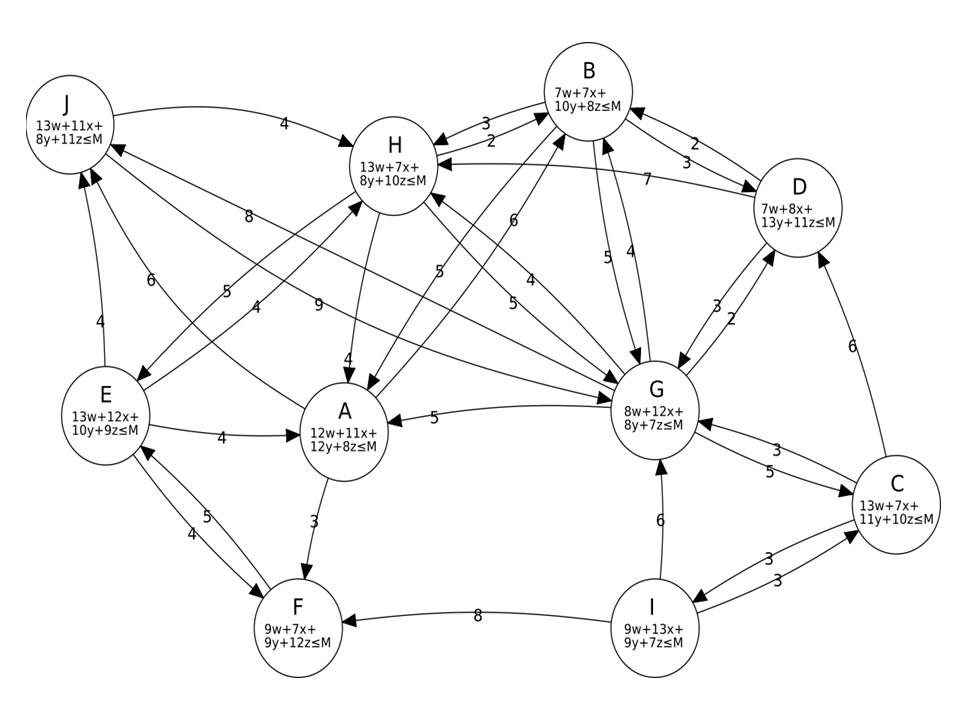

## Zasady eksperymentu WYSPY 2021

Istnieje archipelag dziesięciu wysp. Schematycznie archipelag ten został przedstawiony na poniższym wykresie:

- Na każdej z wysp produkuje się cztery dobra: `w`, `x`, `y`, `z`.
- Waluta na wyspach jest ta sama – muszelki *$*.
- Ceny produktów są na każdej wyspie inne. Np. na wyspie `A` ograniczenie dane jest wzorem *10**w** + 6**x** + 8**y** + 7**z** ≤ **M***, co oznacza, że za posiadany majątek ***M*** *$* możesz kupić dobro ***w*** za 10 *$* za sztukę lub dobro ***x*** za 6 *$* za sztukę ,…
- Oficjalnie istnieje zakaz handlu między tymi wyspami. Jednak niektórzy turyści zorientowali się, że można na tym zakazie zarobić, działając jak przemytnicy. Jako turysta możesz podróżować zgodnie z kierunkiem strzałek. Koszt podróży podany jest przy strzałce. 

Wyobraź sobie, że jesteś turystą-przemytnikiem.  Znając ceny produkowanych na wyspach towarów oraz koszt przejazdu z wyspy na wyspę, zaplanuj swoją podróż tak, aby zmaksymalizować swój początkowy majątek przez sprzedawanie i kupowanie dóbr produkowanych na wyspach.

- Dysponujesz majątkiem ***M*** = `100` *$*.
- W jednym sezonie możesz odbyć max `20` podróży.
- Punkt startu i zakończenia Twojej podróży to wyspa `A`.
- Musisz odwiedzić wszystkie wyspy, aby podtrzymywać kontakty handlowe.
- Możesz odwiedzić jedną wyspę kilka razy.
- Poruszać się można jedynie po strzałkach. Koszt podroży płacony jest przed a nie po podróży.
- Możesz na wyspie nic nie kupić i nie sprzedać. Możesz kupić jedno dobro lub wiele dóbr jednocześnie.

